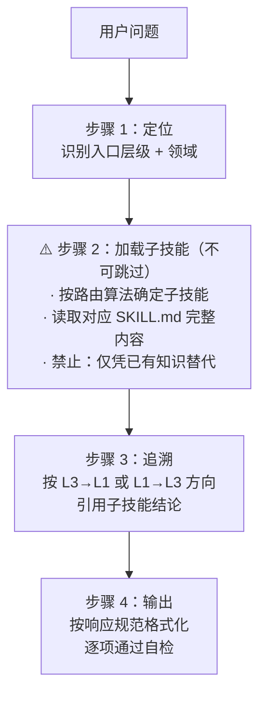

# Rust 元认知技能集

## 概述

**不要直接回答。先通过认知层级追溯。**

这是 Rust 元认知技能集的包级别入口。它不给出表面修复（例如“直接 `.clone()` 就行”），
而是将问题通过三个认知层级进行路由，输出领域正确的架构方案。

### ⚠️ 硬性前置条件：必须先读子技能，再回答问题

本技能集的核心约束——**禁止仅凭主入口内容和已有知识直接回答 Rust 问题。**

回答任何 Rust 具体问题前，必须完成：

1. 按路由算法确定子技能（见路由参考）
2. 读取对应子技能的 SKILL.md
3. 读取认知层元文件（见元文件索引）
4. 如为比较/最佳实践场景，额外读取协商协议
5. 确认已理解内容后，再按追溯流程输出

对于任何具体的 Rust 问题，按以下流程处理：



## 何时使用

| 情况 | 用本技能？ |
|------|-----------|
| 定向：这个技能包能做什么？ | ✅ |
| 把 Rust 问题路由到合适的子技能 | ✅ |
| 应用项目级 Rust 默认设置（edition、lints、unsafe 策略）| ✅ |
| 理解三层元认知模型 | ✅ |
| 具体编译错误（E0382、E0597……）| ✅ |
| 单一概念问题（“什么是 Send？”）| ✅ |
| 比较 / 最佳实践 / 跨领域问题 | ✅（启用协商）|

## 元认知三层模型

问题按三个认知层级追溯：

- **Layer 3 领域约束（WHY）**：业务规则、监管要求、SLA → `domain-*`
- **Layer 2 设计选择（WHAT）**：架构模式、DDD、权衡决策 → `m09-m15`
- **Layer 1 语言机制（HOW）**：所有权、借用、生命周期、trait、并发 → `m01-m07`

> 详细定义见 [`_meta/layer-definitions.md`](_meta/layer-definitions.md)；
> 推理框架与追踪示例见 [`_meta/reasoning-framework.md`](_meta/reasoning-framework.md)。

## 路由参考

### 路由算法

按以下顺序处理，匹配即停：

```
① 错误码匹配（最高优先级）
   查错误码路由表 → 读取对应技能

② 协商触发检查
   查协商协议触发列表 → 匹配则启用协商模式

③ 领域 × 错误组合
   查双层 Skill 加载表 → 同时读取 L1 + L3 技能

④ 关键词匹配
   按认知层级查对应路由表：
   · L1 信号 → 第 1 层 Skill 表
   · L2 信号 → 第 2 层 Skill 表
   · L3 信号 → 第 3 层 Skill 表

⑤ 关键词冲突
   单关键词匹配多个技能 → 查下方冲突解决表

⑥ 功能/工具匹配
   查功能路由表 → 按指定操作处理

⑦ 兜底
   以上均不匹配 → 读取 l2-design/design-mental-model/SKILL.md
```

### 关键词冲突解决

| 关键词 | 解决 |
|--------|------|
| `unsafe` | **`unsafe-checker`**（比 `m11` 更具体） |
| `error` | 通用用 **`m06`**，领域特定用 **`m13`** |
| `RAII` | 设计用 **`m12`**，实现用 **`m01`** |
| `crate` | 版本用 **`rust-learner`**，集成用 **`m11`** |
| `tokio` | API 用 **`tokio-*`**，概念用 **`m07`** |

### 按入口点路由

| 用户信号 | 入口层 | 方向 | 首个技能 |
|----------|--------|------|----------|
| E0xxx 错误 | 第 1 层 | 向上追溯 ↑ | 见下方错误码路由 |
| 编译错误 | 第 1 层 | 向上追溯 ↑ | 见下方错误码路由 |
| “怎么设计……” | 第 2 层 | 检查 L3，然后向下 ↓ | `design-domain` |
| “构建 [领域] 应用” | 第 3 层 | 向下追溯 ↓ | `domain-*` |
| “最佳实践……” | 第 2 层 | 双向 | `m09-m15` |
| 性能问题 | 第 1 → 2 层 | 向上再向下 | `design-performance` |

### 双层 Skill 加载

当领域关键词与错误/机制同时出现时，**必须同时加载两层技能**：

| 领域关键词 | L1 技能 | L3 技能 |
|-----------|---------|---------|
| Web API、HTTP、axum、handler | `mechanism-concurrency` | **`domain-web`** |
| 交易、支付、trading、payment | `mechanism-ownership` | **`domain-fintech`** |
| CLI、terminal、clap | `mechanism-concurrency` | **`domain-cli`** |
| kubernetes、grpc、microservice | `mechanism-concurrency` | **`domain-cloud-native`** |
| embedded、no_std、MCU | `mechanism-resource` | **`domain-embedded`** |

### 第 1 层 Skill（语言机制）

| 技能 | 核心问题 | 路由模式 |
|------|----------|---------|
| [mechanism-ownership](l1-mechanisms/mechanism-ownership/SKILL.md) | 谁拥有这份数据？ | move、borrow、lifetime、E0382、E0597 |
| [mechanism-resource](l1-mechanisms/mechanism-resource/SKILL.md) | 哪种所有权模式合适？ | Box、Rc、Arc、RefCell、Cell |
| [mechanism-mutability](l1-mechanisms/mechanism-mutability/SKILL.md) | 为什么必须改变？ | mut、内部可变性、E0499、E0502、E0596 |
| [mechanism-zero-cost](l1-mechanisms/mechanism-zero-cost/SKILL.md) | 编译期还是运行期多态？ | generic、trait、inline、单态化 |
| [mechanism-type-driven](l1-mechanisms/mechanism-type-driven/SKILL.md) | 类型如何防止非法状态？ | 类型状态、phantom、newtype |
| [mechanism-error-handling](l1-mechanisms/mechanism-error-handling/SKILL.md) | 预期失败还是程序缺陷？ | Result、Error、panic、?、anyhow、thiserror |
| [mechanism-concurrency](l1-mechanisms/mechanism-concurrency/SKILL.md) | CPU 密集型还是 I/O 密集型？ | Send、Sync、thread、async、channel |
| [mechanism-testing](l1-mechanisms/mechanism-testing/SKILL.md) | 这个行为的正确性如何验证？ | test、测试、assert、单元测试、集成测试 |
| **`unsafe-checker`** | unsafe 代码审查 | unsafe、FFI、extern、raw pointer、transmute |

### 第 2 层 Skill（设计选择）

| 技能 | 核心问题 | 路由模式 |
|------|----------|---------|
| [design-domain](l2-design/design-domain/SKILL.md) | 这个概念扮演什么角色？ | 领域模型、业务逻辑 |
| [design-performance](l2-design/design-performance/SKILL.md) | 瓶颈在哪里？ | 性能、优化、基准测试 |
| [design-ecosystem](l2-design/design-ecosystem/SKILL.md) | 该用哪个 crate？ | 集成、互操作、绑定 |
| [design-lifecycle](l2-design/design-lifecycle/SKILL.md) | 何时创建 / 使用 / 清理？ | 资源生命周期、RAII、Drop |
| [design-domain-error](l2-design/design-domain-error/SKILL.md) | 谁来处理这个错误？ | 领域错误、恢复策略 |
| [design-mental-model](l2-design/design-mental-model/SKILL.md) | 如何理解这个问题？ | 心智模型、如何思考 |
| [design-anti-pattern](l2-design/design-anti-pattern/SKILL.md) | 是否隐藏了设计问题？ | 反模式、常见错误、陷阱 |

### 第 3 层 Skill（领域约束）

| 技能 | 用途 | 领域关键词 |
|------|------|-----------|
| [domain-fintech](l3-domains/domain-fintech/SKILL.md) | 金融科技设计约束 | fintech、trading、decimal、currency |
| [domain-web](l3-domains/domain-web/SKILL.md) | Web 服务架构指导 | web server、HTTP、REST、axum、actix |
| [domain-cli](l3-domains/domain-cli/SKILL.md) | CLI 工具架构指导 | CLI、command line、clap、terminal |
| [domain-embedded](l3-domains/domain-embedded/SKILL.md) | 嵌入式与 no_std 架构 | no_std、microcontroller、firmware |
| [domain-cloud-native](l3-domains/domain-cloud-native/SKILL.md) | 云原生设计约束 | kubernetes、docker、grpc、microservice |
| [domain-iot](l3-domains/domain-iot/SKILL.md) | 物联网设计约束 | embedded、sensor、mqtt、iot |
| [domain-ml](l3-domains/domain-ml/SKILL.md) | 机器学习设计约束 | ml、tensor、model、inference |

### 错误码路由

| 错误码 | 路由到 | 常见原因 |
|--------|--------|----------|
| E0382 | `mechanism-ownership` | 使用了移动的值 |
| E0597 | `mechanism-ownership` | 生命周期太短 |
| E0506 | `mechanism-ownership` | 不能给借用的变量赋值 |
| E0507 | `mechanism-ownership` | 不能移出借用内容 |
| E0515 | `mechanism-ownership` | 返回局部引用 |
| E0716 | `mechanism-ownership` | 临时值被丢弃 |
| E0106 | `mechanism-ownership` | 缺少生命周期标注 |
| E0596 | `mechanism-mutability` | 不能借用为可变 |
| E0499 | `mechanism-mutability` | 多个可变借用 |
| E0502 | `mechanism-mutability` | 借用冲突 |
| E0277 | `m04` / `m07` | Trait 约束未满足 |
| E0308 | `mechanism-zero-cost` | 类型不匹配 |
| E0599 | `mechanism-zero-cost` | 未找到方法 |
| E0038 | `mechanism-zero-cost` | Trait 不是 object-safe |
| E0433 | `design-ecosystem` | 找不到 crate/模块 |

### 功能路由表

| 模式 | 路由到 | 操作 |
|------|--------|------|
| 最新版本 / 最新动态 | **`rust-learner`** | 使用 agent |
| API / 文档 / documentation | **`docs-researcher`** | 使用 agent |
| 代码风格 / 命名 / clippy | **`根 SKILL.md 代码风格`** | 读取 skill |
| unsafe 代码 / FFI | **`unsafe-checker`** | 读取 skill |
| 测试 / 测试策略 / 断言 / 快照 | **`mechanism-testing`** | 读取 skill |
| 代码审查 | **`os-checker`** | 见 [`router/integrations/os-checker.md`](router/integrations/os-checker.md) |

### 协商协议触发

以下查询**必须**启用协商协议：

- 比较 / 对比 / compare / vs / versus / 区别 / difference
- 最佳实践 / best practice / 推荐 / recommend
- 领域 + 错误（如“交易系统 E0382”）
- 多技术（如“tokio 和 async-std”）
- 范围模糊（如“tokio 性能”）

需要协商时，响应须结构化：查询类型、置信度（高/中/低/不确定）、差距、综合答案。

> 完整协议、响应格式与置信度判定见
> [`_meta/negotiation-protocol.md`](_meta/negotiation-protocol.md)；
> 协商流程示例见 [`router/examples/workflow.md`](router/examples/workflow.md)。

## 元文件索引

| 文件 | 用途 |
|------|------|
| [`_meta/layer-definitions.md`](_meta/layer-definitions.md) | 三层认知模型详细定义 |
| [`_meta/reasoning-framework.md`](_meta/reasoning-framework.md) | 推理框架与追踪示例 |
| [`_meta/negotiation-protocol.md`](_meta/negotiation-protocol.md) | 协商协议完整规范 |
| [`_meta/externalization.md`](_meta/externalization.md) | 外部化认知（`_reasoning/` 文件模式）|
| [`router/patterns/negotiation.md`](router/patterns/negotiation.md) | 协商协议补充细节 |
| [`router/examples/workflow.md`](router/examples/workflow.md) | 路由工作流程示例 |
| [`router/integrations/os-checker.md`](router/integrations/os-checker.md) | OS-Checker 集成 |
| [`l1-mechanisms/unsafe-checker/SKILL.md`](l1-mechanisms/unsafe-checker/SKILL.md) | unsafe 审查规则 |

## 响应规范

### 默认输出模板

非协商场景按以下格式回答：

```
## 认知追溯
**入口层：** {L1/L2/L3}
**路由匹配：** {①~⑦ 中命中项}
**已读技能：** {skill 列表}
**引用摘要：** {每个已读技能的核心结论摘要，证明已真实读取}

### 追溯过程
{按 L3→L1 或 L1→L3 方向，引用子技能结论}

### 综合方案
{架构方案或修复建议，说明每层约束如何影响决策}
```

### 回答前自检（必须逐项确认）

- [ ] 已用路由算法确定子技能
- [ ] 已读取对应子技能的 SKILL.md（而非仅凭记忆）
- [ ] 追溯方向正确（L3→L1 或 L1→L3）
- [ ] 已覆盖所有相关认知层级
- [ ] 输出中引用了子技能的具体结论（而非仅列文件名）

### 阻塞升级

| 情况 | 升级动作 |
|------|---------|
| 当前技能只能定位不能解决 | 沿追溯方向读下一层技能 |
| 三层遍历后仍不足 | 告知用户缺少的领域上下文 |
| 子技能与需求矛盾 | 以用户需求为准，标注矛盾点 |
| 不确定该走哪条路由 | 启用协商模式，输出多个可能方案 |
| **试图不读子技能就直接回答** | **停止。必须先读取对应子技能 SKILL.md 完整内容** |

## 默认项目设置

创建 Rust 项目或 `Cargo.toml` 文件时，始终使用：

```toml
[package]
edition = "2024"       # 最新稳定版，不用 2021 或更早
rust-version = "1.96"  # 明确 MSRV

[lints.rust]
unsafe_code = "warn"

[lints.clippy]
all = "warn"
pedantic = "warn"
```

规则：

- 始终使用 `edition = "2024"`
- 包含 `rust-version` 明确 MSRV
- 默认启用 clippy `all` + `pedantic`

## 代码风格要点

完整代码风格参考见 [`_meta/code-style.md`](_meta/code-style.md)。此处仅保留最常用的核心规则。

### 快速参考

```
命名：snake_case（函数/变量），CamelCase（类型），SCREAMING_SNAKE_CASE（常量）
格式：rustfmt（直接使用）
文档：/// 用于公开项，//! 用于模块文档
Lint：#![warn(clippy::all)]
```

### Import 排序

```toml
# rustfmt.toml
reorder_imports = true
imports_granularity = "Crate"
group_imports = "StdExternalCrate"
```

顺序规则：`std` → 外部 crate → workspace crate → `super::` → `crate::`

```rust
use std::sync::Arc;
use chrono::Utc;
use serde::Deserialize;
use broker::database::PooledConnection;
use super::schema::{Context, Payload};
use crate::models::Event;
```

> 截至 Rust 1.96，`group_imports` 与 `imports_granularity` 仍未稳定（tracking: #4991, #5083），
> 需使用 nightly 执行 rustfmt：`cargo +nightly fmt`

### 命名（Rust 特定）

| 规则 | 指南 |
|------|------|
| 不用 `get_` 前缀 | `fn name()` 而非 `fn get_name()` |
| 迭代器约定 | `iter()` / `iter_mut()` / `into_iter()` |
| 转换命名 | `as_`（廉价借用）、`to_`（昂贵）、`into_`（转移所有权） |
| 静态变量前缀 | `static` 用 `G_CONFIG`，`const` 不加前缀 |

### 注释约定

| 前缀 | 用途 | 示例 |
|--------|---------|---------|
| `// SAFETY:` | unsafe 块的安全前提 | `// SAFETY: ptr 非空且对齐` |
| `// PERF:` | 性能优化说明 | `// PERF: 此处避免分配，复用缓冲区` |
| `// CONTEXT:` | 设计上下文/外部引用 | `// CONTEXT: ADR-42 见 link` |
| `// TODO(issue #N):` | 待办事项带链接 | `// TODO(#123): 升级 hyper 2.0 后删除此 workaround` |

### `#[expect]` 优于 `#[allow]`

```rust
// ✅ expect：lint 不触发时会警告（保持清洁）
#[expect(clippy::large_enum_variant)]
enum Message { Code(u8), Content(Box<[u8; 1024]>) }

// ❌ allow：静默忽略，lint 修复后仍无反馈
#[allow(clippy::large_enum_variant)]
enum Message { Code(u8), Content(Box<[u8; 1024]>) }
```

规则：

- 始终用 `#[expect]` 替代 `#[allow]`，每条需附带注释说明原因
- 仅在理解 lint 触发原因且有充分理由时禁用
- 避免全局 lint 覆盖，除非是核心 crate 已知问题

### 基础规范

- `snake_case` 变量/函数；`PascalCase` 类型/trait；`SCREAMING_SNAKE_CASE` 常量
- 行宽 ≤ 100 字符
- 库代码用 `?` operator，避免 `unwrap()`（用 `expect` 带语义消息）
- 每个 `unsafe` 块必须有 `// SAFETY:` 注释：

```rust
// SAFETY: 上方已验证 index < len，此处访问必然在边界内
unsafe { slice.get_unchecked(index) }
```

> 完整指南见 [Rust Style Guide](https://doc.rust-lang.org/style-guide/) 或 [Rust API Guidelines](https://rust-lang.github.io/api-guidelines/)。
> unsafe 审查规则见 [`l1-mechanisms/unsafe-checker/SKILL.md`](l1-mechanisms/unsafe-checker/SKILL.md)。

### 工具与实验

| 技能 | 用途 |
|------|------|
| [rust-daily](../rust-daily/SKILL.md) | Rust 每日 / 每周动态与新闻速览 |
| [rust-skill-creator](../rust-skill-creator/SKILL.md) | 为 crate / 标准库文档创建动态 Skill |
| [core-actionbook](../.system/core-actionbook/SKILL.md) | 浏览器自动化预计算操作手册（MCP） |
| [core-agent-browser](../.system/core-agent-browser/SKILL.md) | 浏览器自动化 CLI 工作流支持 |
| [core-dynamic-skills](../.system/core-dynamic-skills/SKILL.md) | 基于项目依赖动态管理 crate Skill |
| [core-fix-skill-docs](../.system/core-fix-skill-docs/SKILL.md) | 检查并修复动态 Skill 文档引用 |
| [meta-cognition-parallel](experimental/meta-cognition-parallel/SKILL.md) | 三层认知维度并行分析（实验性） |
