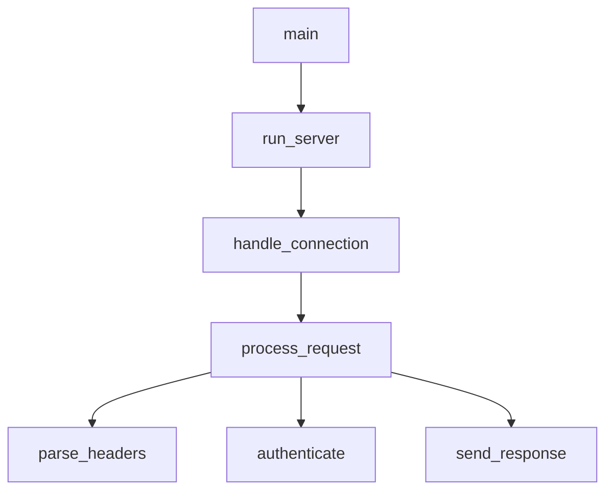

# Rust 调用图

使用 LSP 调用层级可视化函数调用关系。

## Usage

```
/rust-call-graph <function_name> [--depth N] [--direction in|out|both]
```

**选项：**

- `--depth N`：遍历深度（默认：3）
- `--direction`：`in`（调用者）、`out`（被调用者）、`both`

**示例：**

- `/rust-call-graph process_request` - 显示调用者和被调用者
- `/rust-call-graph handle_error --direction in` - 仅显示调用者
- `/rust-call-graph main --direction out --depth 5` - 深度分析被调用者

## LSP 操作

### 1. 准备调用层级

获取函数的调用层级项。

```
LSP(
  operation: "prepareCallHierarchy",
  filePath: "src/handler.rs",
  line: 45,
  character: 8
)
```

### 2. 传入调用（谁调用了这个？）

```
LSP(
  operation: "incomingCalls",
  filePath: "src/handler.rs",
  line: 45,
  character: 8
)
```

### 3. 传出调用（这个调用了什么？）

```
LSP(
  operation: "outgoingCalls",
  filePath: "src/handler.rs",
  line: 45,
  character: 8
)
```

## 工作流

```
User: "Show call graph for process_request"
    │
    ▼
[1] 查找函数位置
    LSP(workspaceSymbol) 或 Grep
    │
    ▼
[2] 准备调用层级
    LSP(prepareCallHierarchy)
    │
    ▼
[3] 获取传入调用（调用者）
    LSP(incomingCalls)
    │
    ▼
[4] 获取传出调用（被调用者）
    LSP(outgoingCalls)
    │
    ▼
[5] 递归扩展到深度 N
    │
    ▼
[6] 生成 ASCII 可视化
```

## 输出格式

### 传入调用（谁调用了这个？）

```
## Callers of `process_request`

main
└── run_server
    └── handle_connection
        └── process_request  ◄── YOU ARE HERE
```

### 传出调用（这个调用了什么？）

```
## Callees of `process_request`

process_request  ◄── YOU ARE HERE
├── parse_headers
│   └── validate_header
├── authenticate
│   ├── check_token
│   └── load_user
├── execute_handler
│   └── [dynamic dispatch]
└── send_response
    └── serialize_body
```

### 双向（Both）

```
## Call Graph for `process_request`

                    ┌─────────────────┐
                    │      main       │
                    └────────┬────────┘
                             │
                    ┌────────▼────────┐
                    │   run_server    │
                    └────────┬────────┘
                             │
                    ┌────────▼────────┐
                    │handle_connection│
                    └────────┬────────┘
                             │
        ┌────────────────────┼────────────────────┐
        │                    │                    │
┌───────▼───────┐   ┌───────▼───────┐   ┌───────▼───────┐
│ parse_headers │   │ authenticate  │   │send_response  │
└───────────────┘   └───────┬───────┘   └───────────────┘
                            │
                    ┌───────┴───────┐
                    │               │
             ┌──────▼──────┐ ┌──────▼──────┐
             │ check_token │ │  load_user  │
             └─────────────┘ └─────────────┘
```

## 分析洞察

生成调用图后，提供见解：

```
## 分析

**入口点：** main、test_process_request
**叶子函数：** validate_header、serialize_body
**热点路径：** main → run_server → handle_connection → process_request
**复杂度：** 12 个函数，3 层深度

**潜在问题：**
- `authenticate` 扇出高（4 个被调用者）
- `process_request` 被 3 处调用（考虑是否是有意设计）
```

## 常见模式

| 用户提问 | 方向 | 用途 |
|-----------|-----------|----------|
| "谁调用了 X？" | incoming | 影响分析 |
| "X 调用了什么？" | outgoing | 理解实现 |
| "显示调用图" | both | 全貌 |
| "从 main 追踪到 X" | outgoing | 执行路径 |

## 可视化选项

| 样式 | 最佳用途 |
|-------|----------|
| 树形（默认） | 简单层级 |
| 框图 | 复杂关系 |
| 平面列表 | 大量连接 |
| Mermaid | 导出到文档 |

### Mermaid 导出



## 相关技能

| 场景 | 参考 |
|------|-----|
| 查找定义 | rust-code-navigator |
| 项目结构 | rust-symbol-analyzer |
| Trait 实现 | rust-trait-explorer |
| 安全重构 | rust-refactor-helper |
